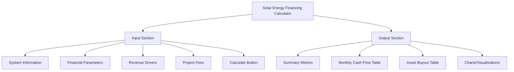
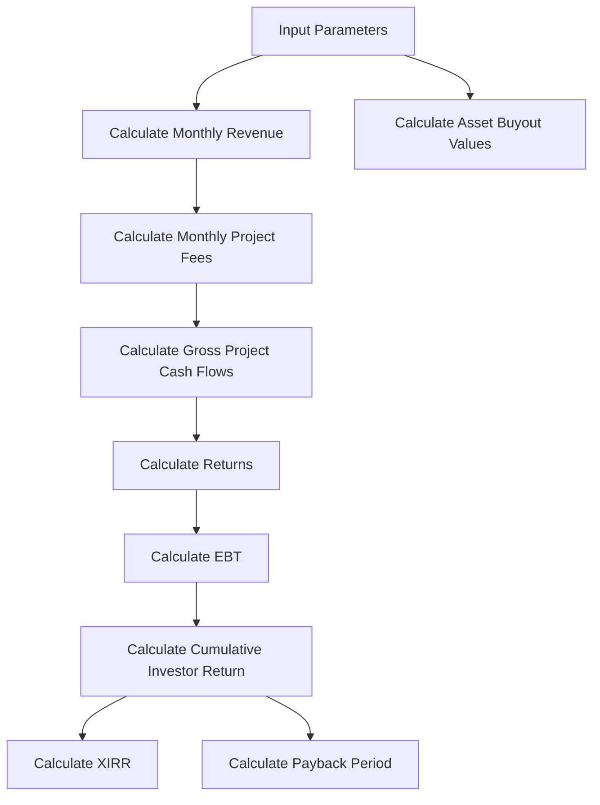
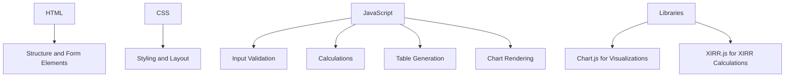

# Solar Energy Financing Calculator - Implementation Plan

## 1. Overview

We'll create a web-based calculator that allows users to assess the feasibility of financing a solar PV system with an optional battery component. The calculator will aim for an investor XIRR of 15-25% and provide a comprehensive monthly breakdown of cash flows over the entire contract term.

## 2. User Interface Structure

The application will have a clean, professional design with two main sections:



## 3. Input Fields

### System Information
- Total Capital Investment (R)
- PV System Size (kWp)
- Battery Size (kWh)
- Average Energy Consumption per Month (kWh)
- Contract Term Options:
  - Solar Asset Term (5, 10, 15, or 20 years)
  - Battery Term (5, 10, 15, or 20 years)
- Installation Date (Month/Year)

### Financial Parameters
- USD/ZAR Exchange Rate
- Effective Sun Hours per Day
- Energy Generated per Month (calculated or manual override)
- Energy Generated per Month (P70) (calculated or manual override)

### Revenue Drivers
- Electricity Purchase Rate (R/kWh)
- Purchase Rate Escalation (% per annum)
- Battery Lease Rate (% of capital or fixed amount)
- Battery Lease Escalation (% per annum)

### Project Fees
- Insurance (% of capital per annum)
- Maintenance (% of capital per annum)
- Landlord Discount (% of total revenue)
- O&M Asset Management Fee (% of total revenue)
- Platform Fee (% of total revenue)
- Target Investor Returns (%)

### Asset Buyout Parameters
- Depreciation Rate (% per annum)
- Buyout Premium (%)

## 4. Calculation Logic

The calculator will implement the following key calculations:



### Key Calculations:
1. **Monthly Revenue**:
   - Solar Revenue = Energy Generated × Electricity Purchase Rate
   - Battery Revenue = Battery Lease Rate
   - Total Revenue = Solar Revenue + Battery Revenue

2. **Monthly Project Fees**:
   - Insurance = (Capital Investment × Insurance Rate) / 12
   - Maintenance = (Capital Investment × Maintenance Rate) / 12
   - Landlord Roof Rental = Total Revenue × Landlord Discount Rate

3. **Gross Project Cash Flows**:
   - Gross Cash Flow = Total Revenue - Project Fees

4. **Returns**:
   - O&M Asset Management Fee = Total Revenue × O&M Rate
   - Platform Fee = Total Revenue × Platform Fee Rate

5. **EBT (Earnings Before Tax)**:
   - EBT = Gross Cash Flow - O&M Fee - Platform Fee

6. **Investor Returns**:
   - Cumulative Investor Return = Sum of EBT over time
   - XIRR Calculation based on initial investment and monthly cash flows
   - Payback Period = Time to recover initial investment

7. **Asset Buyout**:
   - Residual Asset Value = Initial CapEx × (1 - Depreciation Rate)^years
   - Buyout Premium = Residual Asset Value × Buyout Premium Rate
   - Total Buyout = Residual Asset Value + Buyout Premium

## 5. Output Display

### Summary Metrics
- XIRR (%)
- Payback Period (years and months)
- Total Return (R)
- Annual Yield (%)
- Monthly Yield (%)

### Monthly Cash Flow Table
- Month/Year
- Revenue (Solar and Battery)
- Project Fees (Insurance, Maintenance, Landlord Roof Rental)
- Gross Project Cash Flows
- Returns (O&M Asset Management Fee, Platform Fee)
- EBT
- Cumulative Investor Return

### Asset Buyout Table
- Year
- Residual Asset Value
- Buyout Premium
- Total Buyout Price

### Charts/Visualizations
- Cumulative Cash Flow Over Time
- Monthly Revenue Breakdown
- Asset Buyout Value Over Time

## 6. Implementation Approach

We'll use HTML, CSS, and JavaScript to create the calculator:



### HTML Structure
- Header with title and brief description
- Input form with organized sections
- Calculate button
- Output section with tabs for different views
- Tables for monthly cash flows and asset buyout
- Canvas elements for charts

### CSS Styling
- Clean, professional design
- Responsive layout
- Clear separation between input and output sections
- Proper spacing and alignment
- Table styling for readability

### JavaScript Components
1. **Input Handling**:
   - Form validation
   - Input sanitization
   - Default values

2. **Calculation Engine**:
   - Core financial calculations
   - XIRR implementation
   - Payback period calculation
   - Monthly cash flow projections
   - Asset buyout calculations

3. **Output Generation**:
   - Dynamic table creation
   - Chart generation
   - Summary statistics calculation
   - Formatting of currency and percentage values

4. **Utility Functions**:
   - Date handling
   - Currency formatting
   - Percentage formatting
   - Array manipulation for financial calculations

## 7. File Structure

```
/
├── index.html              # Main HTML file
├── css/
│   ├── styles.css          # Main stylesheet
│   └── normalize.css       # CSS reset
├── js/
│   ├── main.js             # Main JavaScript file
│   ├── calculations.js     # Financial calculation functions
│   ├── ui.js               # UI interaction functions
│   ├── tables.js           # Table generation functions
│   ├── charts.js           # Chart generation functions
│   └── utils.js            # Utility functions
└── lib/                    # Third-party libraries
    ├── chart.js            # For charts
    └── xirr.js             # For XIRR calculations
```

## 8. Development Phases

### Phase 1: Setup and Basic Structure
- Create HTML structure
- Implement basic CSS styling
- Set up JavaScript files and structure

### Phase 2: Input Form Implementation
- Create all input fields with proper validation
- Implement default values
- Add form submission handling

### Phase 3: Core Calculations
- Implement monthly cash flow calculations
- Develop XIRR and payback period calculations
- Create asset buyout calculations

### Phase 4: Output Display
- Generate summary metrics
- Create dynamic tables for monthly cash flows
- Implement asset buyout table

### Phase 5: Visualizations
- Add charts for cash flow
- Create revenue breakdown visualizations
- Implement asset buyout value chart

### Phase 6: Testing and Refinement
- Test with various input scenarios
- Verify calculations against the Excel model
- Optimize performance
- Refine UI/UX

## 9. Testing Strategy

We'll test the calculator with various scenarios to ensure accuracy:

1. **Validation Testing**:
   - Test input validation for all fields
   - Verify handling of edge cases (zero values, negative values, etc.)

2. **Calculation Testing**:
   - Compare calculator results with the Excel model
   - Test with different contract terms
   - Verify XIRR calculations
   - Check payback period calculations

3. **UI Testing**:
   - Test responsiveness on different screen sizes
   - Verify table generation with large datasets
   - Test chart rendering

4. **Performance Testing**:
   - Measure calculation time for long contract terms
   - Optimize if necessary

## 10. Potential Enhancements (Future Scope)

1. **Save/Load Functionality**:
   - Allow users to save scenarios
   - Import/export functionality

2. **Comparison Feature**:
   - Compare multiple scenarios side by side

3. **PDF Export**:
   - Generate downloadable PDF reports

4. **Sensitivity Analysis**:
   - Allow users to see how changes in key parameters affect outcomes

5. **Localization**:
   - Support for multiple currencies and languages